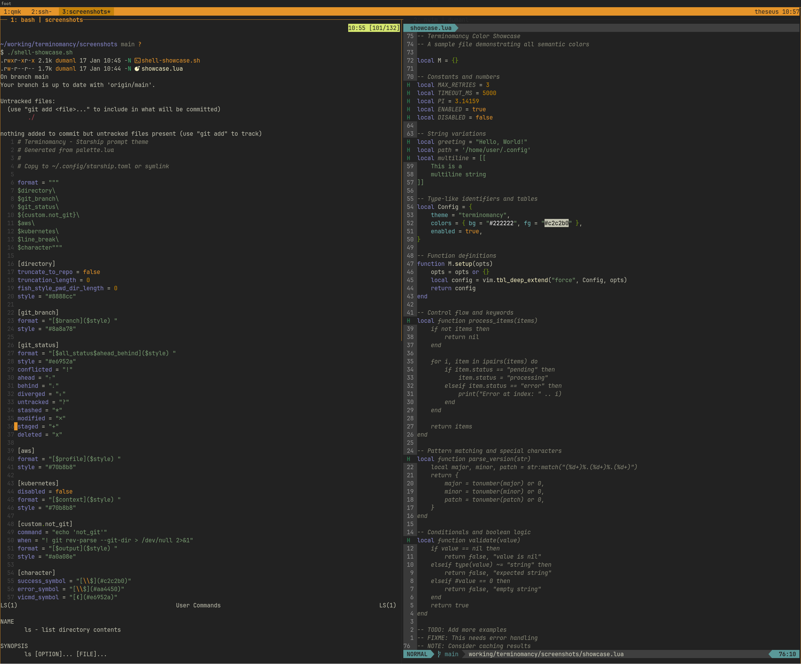
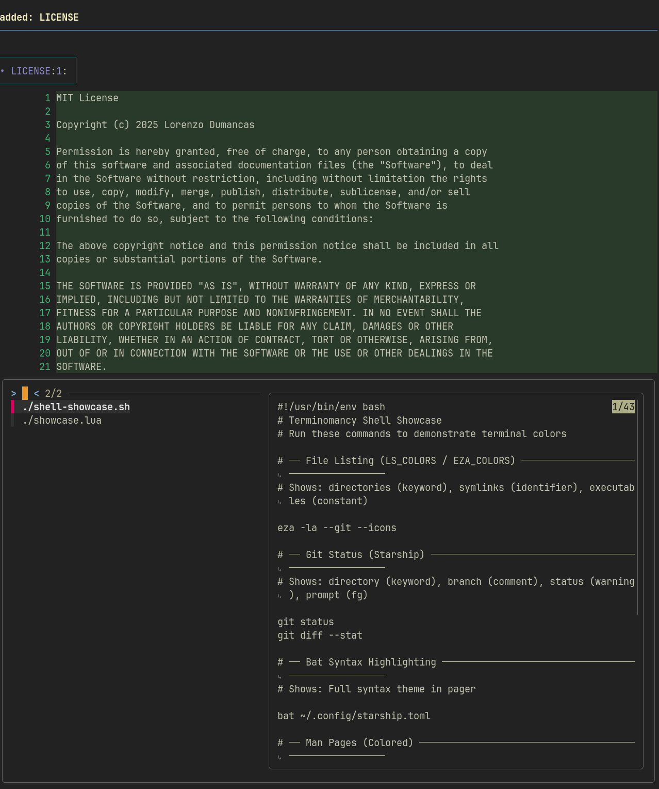

# Terminomancy

A dark color scheme for terminal-based development environments. 

A reinterpretation of [sourcerer](https://github.com/xero/sourcerer) by xero harrison, based on sorcerer by Jeet Sukumaran, based on mustang by Henrique C. Alves.

## Preview





## Supported Tools

- **tmux**
- **Neovim**
  - Tree-sitter
  - Language Server Protocol (LSP)
- **Shell**
  - LS_COLORS / EZA_COLORS
  - Bat syntax highlighter
  - Starship prompt
- **Terminal emulators:**
  - Alacritty
  - Foot
  - iTerm2
  - Blink.sh
  - Windows Terminal
- **Wayland:**
  - Sway
  - Waybar
  - Fuzzel
  - Mako
  - gtklock

## Installation

### tmux

Source the theme in your `~/.tmux.conf`:

```tmux
source-file /path/to/terminomancy/tmux/terminomancy.conf
```

### Neovim

Symlink or copy the colorscheme to your nvim colors directory:

```bash
mkdir -p ~/.config/nvim/colors
ln -s /path/to/terminomancy/nvim/colors/terminomancy.lua ~/.config/nvim/colors/
```

Then in your config:

```lua
vim.cmd("colorscheme terminomancy")
```

### Terminal emulators

**Alacritty** — Import the theme in your `~/.config/alacritty/alacritty.toml`:

```toml
[general]
import = ["/path/to/terminomancy/alacritty/terminomancy.toml"]
```

**Foot** — Symlink or copy to `~/.config/foot/foot.ini`

**iTerm2** — Import `terminals/terminomancy-iterm.json` via Preferences → Profiles → Colors → Import

**Blink.sh** — [Installation guide](https://github.com/blinksh/themes/tree/master?tab=readme-ov-file#blink-shell-themes)

**Windows Terminal** — [Installation guide](https://learn.microsoft.com/en-us/windows/terminal/customize-settings/themes)

### LS_COLORS / EZA_COLORS

Source the script in your shell rc file (`.bashrc` or `.zshrc`):

```bash
source /path/to/terminomancy/shell/ls-colors-terminomancy.sh
```

### Bat

Copy the theme and rebuild the cache:

```bash
mkdir -p ~/.config/bat/themes
cp /path/to/terminomancy/bat/Terminomancy.tmTheme ~/.config/bat/themes/
bat cache --build
```

Then set the theme in your bat config or via `--theme=Terminomancy`.

### Other tools

For Starship, Sway, Waybar, Fuzzel, Mako, and gtklock — symlink the generated config to the appropriate location in `~/.config/`. For example:

```bash
ln -s /path/to/terminomancy/starship/starship.toml ~/.config/starship.toml
```

## Color Palette

All colors are defined in `palette.lua` as the single source of truth. Run `lua generate.lua` to regenerate all config files.

See [README_PALETTE.md](README_PALETTE.md) for the full color table.

## Semantic Usage Guide

Beyond code syntax highlighting, colors have consistent semantic meanings across UI elements. When adding new tools to terminomancy, follow these patterns:

### Attention & Focus

| Color | When to Use |
|-------|-------------|
| `accent` | Focused/active states, cursor, important context (clock, active profile), mode indicators |
| `accent_dark` | Hover states, secondary emphasis |
| `warning` | Needs attention but not critical (same color as accent — intentional) |

### Structure & Navigation

| Color | When to Use |
|-------|-------------|
| `keyword` | Structural/navigation elements — directories, tags, headers |
| `identifier` | Infrastructure context — containers, symlinks, URLs, cloud resources |
| `preproc` | Config/infra (alternate to identifier) — use for variety when identifier is already used nearby |

### Information Hierarchy

| Color | When to Use |
|-------|-------------|
| `fg` | Primary readable text, default prompt |
| `fg_dim` | Secondary/unimportant info — inactive states, log files, licenses, timestamps |
| `comment` | Metadata — git branches, workspace labels, contextual info that's present but not primary |
| `linenr` | Neutral chrome — line numbers, borders, separators |

### Status & Feedback

| Color | When to Use |
|-------|-------------|
| `error` | Critical errors, urgent notifications — demands immediate attention |
| `diff_del` | Soft errors, deletions, problems — something's wrong but not critical |
| `diff_add` | Success, additions, positive state |
| `diff_change` | Modified/changed state, informational |
| `info` | Informational messages, links |
| `hint` | Suggestions, hints, subtle guidance |

### Examples from Existing Configs

| Element | Color | Rationale |
|---------|-------|-----------|
| Directories (LS_COLORS) | `keyword` | Structural navigation |
| Symlinks (LS_COLORS) | `identifier` | Infrastructure/linking |
| Executables (LS_COLORS) | `constant` | Special capability |
| Git modified (LS_COLORS) | `warning` | Needs attention |
| Focused window (sway) | `accent` | Active state |
| Unfocused window (sway) | `comment` | Present but not primary |
| Urgent window (sway) | `error` | Demands attention |
| Clock (waybar) | `accent` | Important context |
| Workspace button (waybar) | `comment` | Metadata |
| Active pane border (tmux) | `accent` | Focus indicator |
| Notification border (mako) | `accent` | Normal attention |
| Critical notification (mako) | `error` | Urgent attention |
| Directory (starship) | `keyword` | Structural navigation |
| Git branch (starship) | `comment` | Metadata |
| Git status (starship) | `warning` | Needs attention |
| AWS/K8s context (starship) | `identifier` | Infrastructure context |
| Vi cmd mode (starship) | `accent` | Mode indicator |
| Error prompt (starship) | `diff_del` | Soft error |

### Decision Tree

When deciding which color to use for a new element:

1. **Is it focused/active/important?** → `accent`
2. **Is it an error or critical problem?** → `error`
3. **Is it a soft error or deletion?** → `diff_del`
4. **Is it success or addition?** → `diff_add`
5. **Is it structural/navigational?** → `keyword`
6. **Is it infrastructure/config?** → `identifier` or `preproc`
7. **Is it metadata/secondary info?** → `comment`
8. **Is it unimportant/inactive?** → `fg_dim`
9. **Is it normal readable text?** → `fg`

## License

MIT
